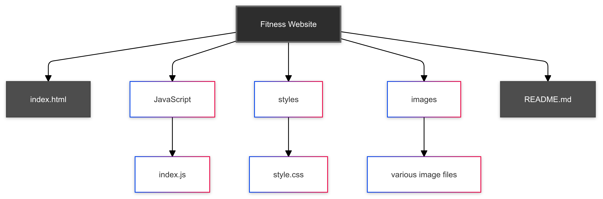

# [Fitness Website](https://thetoriqul.github.io/Fitness-Website/)

This project is a fitness website designed to be responsive for large (desktop) and small (mobile) devices only, providing information about fitness services, workouts, and team members. It includes an interactive BMI calculator with personalized recommendations.

## Table of Contents
- [Overview](#overview)
- [Features](#features)
- [Demo](#demo)
- [Technologies Used](#technologies-used)
- [Project Structure](#project-structure)
- [Sections](#sections)
- [Getting Started](#getting-started)
  - [Prerequisites](#prerequisites)
  - [Installation](#installation)
- [Usage](#usage)
- [BMI Calculator Features](#bmi-calculator-features)
- [Customization](#customization)
- [Browser Compatibility](#browser-compatibility)
- [Performance Considerations](#performance-considerations)
- [Testing](#testing)
- [Deployment](#deployment)
- [Future Enhancements](#future-enhancements)
- [Contributing](#contributing)
- [Contact](#contact)

## Overview

This fitness website is designed to showcase fitness services, workouts, and team members. It includes various sections to engage users and provide valuable information, including a fully functional BMI calculator. The website is specifically optimized for large (desktop) and small (mobile) devices, ensuring a seamless experience on these two device types.

## Features

- Responsive design optimized for large (desktop) and small (mobile) devices only
- Responsive navigation menu
- Hero section with call-to-action buttons
- Habit-changing section with exercise categories
- Running promotion section
- Training and exercises showcase
- Interactive BMI calculator with:
  - Personal metrics input (height, weight, age, sex)
  - Activity level consideration
  - BMI calculation and weight status
  - Daily calorie needs estimation
  - Personalized recommendations
- Team members presentation
- Customer testimonials
- Footer with additional links and information

## Demo

Visit the live demo: [Fitness Website](https://thetoriqul.github.io/Fitness-Website/)

## Technologies Used

- HTML5
- CSS3
- JavaScript (ES6+)
- FontAwesome for icons

## Project Structure

<figure >
    

        
        
Project Architecture
 
    

   </figure>

## BMI Calculator Features

The newly implemented BMI calculator (`index.js`) includes:

1. **Input Handling:**
   - Height (cm)
   - Weight (kg)
   - Age
   - Sex selection
   - Activity level selection

2. **Calculations:**
   - BMI computation
   - Basal Metabolic Rate (BMR)
   - Daily calorie needs based on activity level

3. **Results Display:**
   - BMI value
   - Weight status (Underweight, Healthy, Overweight, Obese)
   - Estimated daily calorie needs
   - Personalized recommendations based on results

4. **Input Validation:**
   - Ensures all required fields are filled
   - Validates numerical inputs
   - Prevents form submission with invalid data

## Deployment

To deploy using GitHub Pages:

1. Go to your repository settings
2. Navigate to the "Pages" section
3. Choose the branch you want to deploy (usually `main` or `master`)
4. Select the root folder as the source
5. Save the settings and wait for GitHub to deploy your site
6. After deployment, test on both large (desktop) and small (mobile) devices

## Future Enhancements

- Expand the BMI calculator functionality:
  - Add metric/imperial unit toggle
  - Include body fat percentage estimation
  - Add progress tracking features
- Add a blog section for fitness tips and articles
- Integrate a workout scheduling system
- Develop a mobile app version of the website
- Consider developing a tablet-specific layout if needed in the future
- Add exercise tracking and goal setting features

## Contributing

Contributions to the Fitness Website repository are welcome! If you have suggestions, improvements, or bug fixes, feel free to open an issue or submit a pull request. Please ensure that your contributions adhere to the project's guidelines and coding standards, and maintain responsiveness for both large (desktop) and small (mobile) devices.

## Contact

For any questions or inquiries regarding the project, please feel free to contact me:

- **Email:** toriqul.int@gmail.com
- **Phone:** +65 8936 7705, +8801765 939006
- **Project Link:** https://github.com/TheToriqul/Fitness-Website

---

Copyright © 2024 TheToriqul. All Rights Reserved.